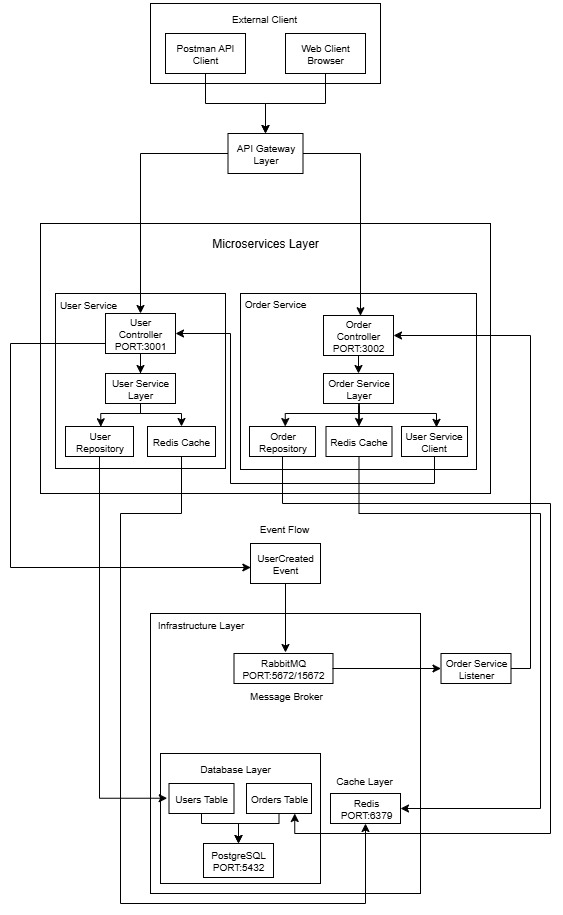

## Deskripsi

Proyek ini adalah aplikasi microservice sederhana yang dibangun menggunakan NestJS yang mendemonstrasikan komunikasi event-driven antara dua layanan: user-service dan order-service. Aplikasi ini menggunakan RabbitMQ untuk komunikasi asynchronous, Redis untuk caching, dan PostgreSQL sebagai database.

## Fitur

user-service:

- Membuat pengguna baru
- Mendapatkan pengguna berdasarkan ID (dengan caching Redis)
- Memancarkan event user_created ketika pengguna baru dibuat

order-service:

- Membuat pesanan hanya jika userId tersedia (dengan memverifikasi dari user-service)
- Mendapatkan pesanan berdasarkan ID pengguna (dengan caching Redis)
- Mendengarkan event user_created dan mencatatnya

## Teknologi yang Digunakan

- NestJS - Framework backend
- RabbitMQ - Message broker untuk komunikasi event-driven
- Redis - Caching layer
- PostgreSQL - Database
- Docker & Docker Compose - Containerization dan orchestration

## Struktur Proyek

```bash
├── docker-compose.yml
├── user-service/
│   ├── src/
│   │   ├── users/
│   │   │   ├── users.controller.ts
│   │   │   ├── users.service.ts
│   │   │   ├── users.repository.ts
│   │   │   ├── user.entity.ts
│   │   │   └── dto/
│   │   ├── app.module.ts
│   │   └── main.ts
│   ├── test/
│   ├── Dockerfile
│   └── package.json
├── order-service/
│   ├── src/
│   │   ├── orders/
│   │   │   ├── orders.controller.ts
│   │   │   ├── orders.service.ts
│   │   │   ├── orders.repository.ts
│   │   │   ├── order.entity.ts
│   │   │   └── dto/
│   │   ├── app.module.ts
│   │   └── main.ts
│   ├── test/
│   ├── Dockerfile
│   └── package.json
└── README.md
```

## Cara Menjalankan Aplikasi

### Prerequisites

Docker dan Docker Compose terinstal di PC/Laptop

### Langkah-langkah

1. Clone repositori ini

```bash
git clone <repository-url>
```

```bash
cd <repository-directory>
```

2. Jalankan aplikasi dengan Docker Compose

```bash
# Start
docker-compose up --build

# Cek status containers
docker-compose ps

# Test koneksi Redis
docker exec -it redis_cache redis-cli ping
# Should return "PONG"


# Hentikan services
docker-compose down

# Semua services
docker-compose logs
```

3. Akses Management Interfaces (RabbitMQ)

- URL: `http://localhost:15672`
- Username: guest
- Password: guest

```bash
# Test koneksi RabbitMQ
docker exec -it rabbitmq_broker rabbitmqctl status
```

Dari sini Anda dapat:

- Melihat queues, exchanges, dan connections
- Memantau message rates
- Melakukan troubleshooting

4. PostgreSQL Database

- Host: localhost:5432
- Database: microservices
- Username: postgres
- Password: password

```bash
# Test koneksi PostgreSQL
docker exec -it postgres_db psql -U postgres -d microservices -c "SELECT version();"
```

Mengecek Database

```bash
# Masuk ke container postgres
docker exec -it postgres_db psql -U postgres -d microservices

# Lihat semua database
\l

# Gunakan database microservices
\c microservices

# Lihat semua tables
\dt

# Lihat struktur table users
\d users

# Lihat struktur table orders
\d orders

# Lihat data users
SELECT * FROM users;

# Lihat data orders
SELECT * FROM orders;

# Hitung jumlah users
SELECT COUNT(*) FROM users;

# Hitung jumlah orders
SELECT COUNT(*) FROM orders;

# Lihat users dengan orders mereka
SELECT u.id, u.name, u.email, COUNT(o.id) as order_count
FROM users u
LEFT JOIN orders o ON u.id = o."userId"
GROUP BY u.id, u.name, u.email;

# Keluar dari psql
\q
```

5. Redis
   Host: localhost:6379

6. Akses layanan

- user-service: http://localhost:3001
- order-service: http://localhost:3002

## Bisa Pull Images Manual

### Docker dengan Build

```bash
# Pull images satu per satu
docker pull postgres:15-alpine
docker pull redis:7-alpine
docker pull rabbitmq:3-management-alpine

# Cek images yang sudah terdownload
docker images

# Jalankan hanya database dan infrastruktur dulu
docker compose up postgres redis rabbitmq

# Di terminal lain, cek status
docker compose ps

# Jika infrastruktur sudah running, baru jalankan services
docker compose up user-service order-service

```

### Docker tanpa Build

```bash
# Hanya jalankan infrastrukturnya
docker compose up -d postgres redis rabbitmq

# Pastikan semua infrastruktur running
docker compose ps

# Lalu jalankan services secara manual di terminal terpisah
# Terminal 1:
cd user-service && npm run start:dev

# Terminal 2:
cd order-service && npm run start:dev
```

## API Microservice

### User Service

Create User (POST)

- URL : `http://localhost:3001/users`
- Method : `POST`
- Headers : `Content-Type: application/json`
- Body (raw JSON) :
  ```bash
  {
    "name": "John Doe",
    "email": "john@example.com"
  }
  ```
- Expected Response (201 Created):
  ```bash
    {
  "id": "a1b2c3d4-e5f6-7890-abcd-ef1234567890",
  "name": "John Doe",
  "email": "john@example.com",
  "createdAt": "2025-09-17T16:48:45.123Z"
  }
  ```

Get User by ID (GET)

- URL : `http://localhost:3001/users/{id}`
- Method : `GET`
- Expected Response (200 Created):
  ```bash
    {
  "id": "a1b2c3d4-e5f6-7890-abcd-ef1234567890",
  "name": "John Doe",
  "email": "john@example.com",
  "createdAt": "2025-09-17T16:48:45.123Z"
  }
  ```

Error Cases - User Service = Create User with duplicate email:

```bash
   {
  "name": "Another John",
  "email": "john@example.com"
}
```

## Order Service

Create Order (POST)

- URL : `http://localhost:3002/orders`
- Method : `POST`
- Headers : `Content-Type: application/json`
- Body (raw JSON) :
  ```bash
  {
  "userId": "a1b2c3d4-e5f6-7890-abcd-ef1234567890",
  "product": "Laptop Gaming",
  "price": 1500
  }
  ```
- Expected Response (201 Created):
  ```bash
    {
  "id": "b2c3d4e5-f6g7-8901-bcde-f23456789012",
  "userId": "a1b2c3d4-e5f6-7890-abcd-ef1234567890",
  "product": "Laptop Gaming",
  "price": 1500,
  "status": "pending",
  "createdAt": "2025-09-17T16:50:30.456Z"
  }
  ```

Get Orders by User ID (GET)

- URL : `http://localhost:3002/orders/user/{userId}`
- Method : `GET`
- Example: `http://localhost:3002/orders/user/a1b2c3d4-e5f6-7890-abcd-ef1234567890`
- Expected Response (200 Created):

  ```bash
    [
  {
    "id": "b2c3d4e5-f6g7-8901-bcde-f23456789012",
    "userId": "a1b2c3d4-e5f6-7890-abcd-ef1234567890",
    "product": "Laptop Gaming",
    "price": 1500,
    "status": "pending",
    "createdAt": "2025-09-17T16:50:30.456Z"
  }
  ]
  ```

  Error Cases - Order Service

  ```bash
   {
  "userId": "non-existent-id",
  "product": "Laptop Gaming",
  "price": 1500
  }
  ```

  Create Order with invalid data:

  ```bash
   {
  "userId": "a1b2c3d4-e5f6-7890-abcd-ef1234567890",
  "product": "",
  "price": -100
  }
  ```

## Arsitektur

Aplikasi ini mengikuti arsitektur mikroservis dengan layanan yang terpisah untuk manajemen pengguna dan pesanan. Komunikasi antara layanan dilakukan secara asynchronous menggunakan RabbitMQ. Redis digunakan sebagai layer caching untuk meningkatkan performa. Setiap layanan memiliki database PostgreSQL sendiri untuk memastikan decoupling.

## Diagram Arsitektur

<p align="center">
  
</p>

### Penjelasan Singkat

- **Client** berinteraksi melalui **API Gateway**.
- **user-service** menangani pembuatan user (`POST /users`) dan mengirim event `user_created`.
- **order-service** menangani pembuatan order (`POST /orders`) serta memvalidasi user.
- **Redis** digunakan untuk caching pada kedua service.
- **RabbitMQ** digunakan sebagai message broker:
  - `user-service` mem-publish event `user_created`.
  - `order-service` mengkonsumsi event `user_created` untuk validasi order.


## Pengujian

Setiap layanan dilengkapi dengan unit test. Untuk menjalankan test:

## Di dalam direktori user-service

`npm test`

## Di dalam direktori order-service

`npm test`
